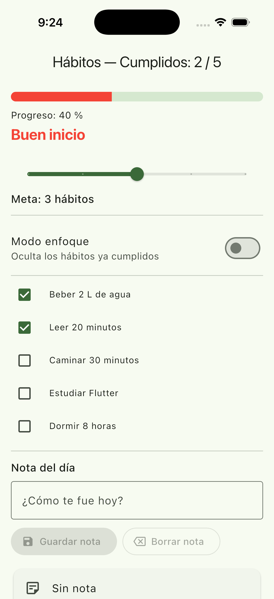
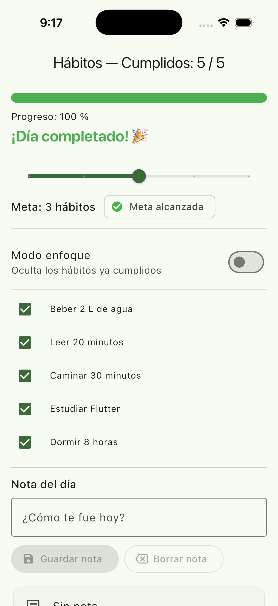
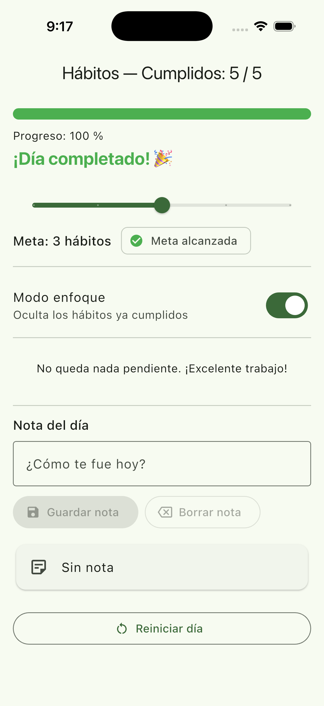
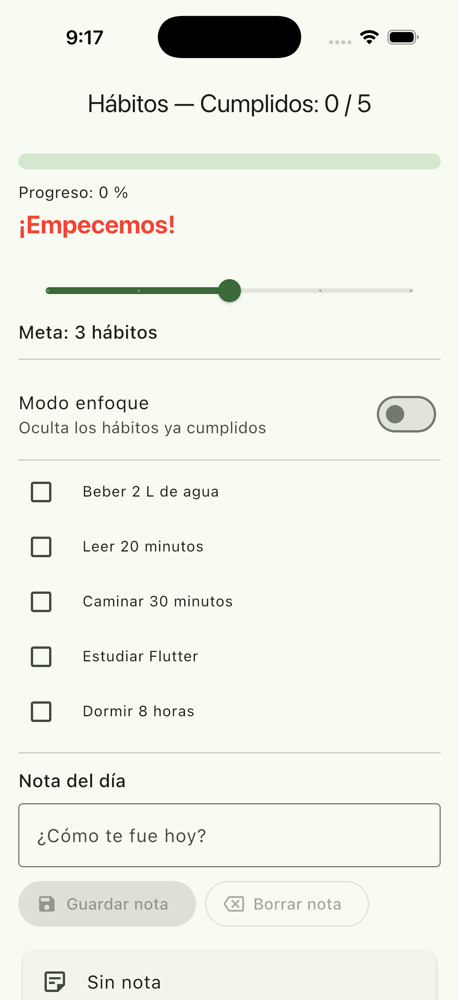

# Panel de hábitos del día

**E2_L1 — Laboratorio 1: Interfaz interactiva con actualización dinámica**
Técnicas de Calidad de Software 01 · 02-2026 · Semana 7
Autor: Rubén Palma

## Descripción

Aplicación Flutter de una sola pantalla que ayuda a seguir el cumplimiento de cinco hábitos durante un día. La lista de hábitos es fija (está escrita en el código); lo que cambia es su estado de cumplimiento y el de los demás controles.

Toda la pantalla se construye a partir de una única fuente de verdad —las variables de estado de la clase `_PanelHabitosState`— de modo que un solo cambio (marcar un checkbox, mover el slider, activar el switch, guardar la nota) se propaga de inmediato al título del `AppBar`, a la barra de progreso, al mensaje motivacional, al distintivo de meta y a la lista de hábitos visibles. No se usa ningún paquete de gestión de estado: únicamente `StatefulWidget` y `setState()`.

## Cómo ejecutar

```bash
flutter pub get
flutter run -d chrome     # o el emulador / dispositivo que prefieras
```

Si descargaste solo los archivos fuente (sin las carpetas de plataforma `android/`, `ios/`, `web/`), genera las plataformas una vez dentro de la carpeta del proyecto:

```bash
flutter create .
flutter pub get
flutter run
```

Verificación de calidad:

```bash
dart format .
flutter analyze     # debe salir "No issues found!"
flutter test        # 4 pruebas de widget que cubren P-1, P-6, P-7, P-8 y P-10
```

## Variables de estado

Todo el estado vive en la clase `_PanelHabitosState` (RT-1). Son cinco variables independientes, por encima del mínimo de tres que pide RT-2:

| Variable | Tipo | Qué representa |
|---|---|---|
| `_cumplidos` | `List<bool>` | Un booleano por hábito, en el mismo orden que `_habitos`. Es la fuente de verdad del cumplimiento del día; se inicializa en `initState()` con `List<bool>.filled(5, false)`. |
| `_meta` | `int` | Cuántos hábitos se propone cumplir la persona hoy (1 a 5). Lo fija el `Slider`; su valor inicial es la constante `_metaInicial = 3`. |
| `_enfoque` | `bool` | Si el "Modo enfoque" está activo. Cuando es `true`, los hábitos ya cumplidos se omiten al construir la lista. |
| `_nota` | `String` | La nota del día **ya confirmada**. Es distinta del texto que hay en el campo: solo cambia al pulsar "Guardar nota" o al enviar el `TextField`. |
| `_historial` | `List<int>` | Extensión opcional. Guarda cuántos hábitos se cumplieron en cada "día" cerrado con "Reiniciar día". |

`_notaCtrl` es un `TextEditingController`: no es estado de la pantalla sino el controlador del campo de texto, y se libera en `dispose()` (RT-9).

### Información derivada (no es estado)

Nada de lo siguiente se guarda en una variable: todo se calcula con getters en el momento de construir la UI (RT-4), así que es imposible que quede desincronizado.

| Getter | Cálculo |
|---|---|
| `_totalCumplidos` | `_cumplidos.where((c) => c).length` |
| `_progreso` | `_totalCumplidos / _habitos.length` |
| `_porcentaje` | `(_progreso * 100).round()` |
| `_metaAlcanzada` | `_totalCumplidos >= _meta` |
| `_mensaje` | Tramos: 0 % → "¡Empecemos!", 1–49 % → "Buen inicio", 50–99 % → "¡Vas muy bien!", 100 % → "¡Día completado! 🎉" |
| `_colorProgreso` | Extensión: rojo < 50 %, ámbar < 100 %, verde = 100 % |
| `_campoNotaVacio` | Se lee directamente de `_notaCtrl.text`, no se copia a una variable |

## Cobertura de los requerimientos

| ID | Dónde se cumple |
|---|---|
| RF-1 | `_construirListaHabitos()` genera un `CheckboxListTile` por cada uno de los 5 hábitos. |
| RF-2 | Título del `AppBar`: `Hábitos — Cumplidos: X / 5`. |
| RF-3 | `LinearProgressIndicator(value: _progreso)` + `Progreso: N %`. |
| RF-4 | Getter `_mensaje`, mostrado bajo la barra con el color del tramo. |
| RF-5 | `Slider` de 1 a 5 con `divisions: 4`, texto `Meta: M hábitos` y `Chip` "Meta alcanzada". |
| RF-6 | `SwitchListTile` "Modo enfoque"; el bucle de la lista salta los índices cumplidos. |
| RF-7 | `TextField` + botón "Guardar nota" + `Card` con `_nota.isEmpty ? 'Sin nota' : _nota`. |
| RF-8 | `_reiniciarDia()` restablece cumplidos, meta, enfoque, nota y limpia el controlador. |
| RF-9 | Todas las acciones pasan por `setState()`, así que el repintado es inmediato. |
| RT-1 a RT-3 | `PanelHabitos` es `StatefulWidget`; el estado vive en `State`; no hay ninguna mutación fuera de `setState()`. |
| RT-4 | Ver la tabla de getters arriba. |
| RT-5 | `build()` solo compone widgets; delega en métodos `_construirX` que no tienen efectos secundarios. |
| RT-6 | `dart format` aplicado; acciones con nombres verbales (`_alternarHabito`, `_reiniciarDia`). |
| RT-7 | `flutter analyze` limpio con `flutter_lints`. |
| RT-8 | `const` en todos los widgets y literales que lo admiten. |
| RT-9 | `_notaCtrl.removeListener(...)` y `_notaCtrl.dispose()` en `dispose()`. |

### Nota sobre la prueba P-9

La extensión opcional pide deshabilitar "Guardar nota" mientras el campo esté vacío, lo que impediría pulsarlo para volver a "Sin nota". Para que P-9 siga siendo posible se añadió un botón **"Borrar nota"**, que limpia el campo y devuelve la tarjeta a "Sin nota". Enviar el campo vacío con la tecla Intro (`onSubmitted`) produce el mismo resultado.

## Extensiones opcionales implementadas

1. **Historial de días.** Cada "Reiniciar día" guarda el total cumplido en `_historial` y se muestra como `Días anteriores: 5, 3, 4`.
2. **Color de la barra por tramos.** Rojo por debajo del 50 %, ámbar por debajo del 100 %, verde al 100 %; el mismo color se aplica al mensaje motivacional.
3. **Botón "Guardar nota" deshabilitado con el campo vacío.** Se consigue con `_notaCtrl.addListener(_alCambiarTextoNota)` en `initState()`, que llama a `setState()` en cada pulsación, y `removeListener` en `dispose()`.

## Capturas

Guarda las imágenes en `docs/capturas/` con estos nombres y se mostrarán aquí:

| Estado | Captura |
|---|---|
| P-1 — 2 de 5 cumplidos, "Buen inicio" |  |
| P-2 — 100 %, "¡Día completado! 🎉" |  |
| P-6 — Modo enfoque activo |  |
| P-10 — Después de "Reiniciar día" |  |

## Reflexión

El error de estado más fácil de cometer en este laboratorio es **duplicar información derivada**. La tentación inicial fue declarar un campo `int _total = 0` e irlo incrementando dentro de `_alternarHabito`, porque parece más barato que recorrer la lista en cada `build()`. El problema aparece en cuanto hay más de un camino que modifica los cumplidos: `_reiniciarDia()` pone todos los booleanos en `false`, y si olvidas poner también `_total = 0` en esa misma función, el `AppBar` sigue anunciando "3 / 5" mientras la lista ya está vacía de marcas. La barra, el mensaje y el distintivo de meta quedan contando historias distintas sobre el mismo día. Lo evité no guardando nada que se pueda calcular: `_totalCumplidos`, `_progreso`, `_mensaje` y `_metaAlcanzada` son getters que leen `_cumplidos` en el momento de pintar, de manera que la desincronización es estructuralmente imposible.

El segundo error que tuve presente fue **mutar el estado sin `setState()`**. Escribir `_cumplidos[index] = true;` funciona —el dato cambia— pero Flutter no se entera de que debe reconstruir el widget, así que la interfaz se queda congelada y el fallo parece un problema del `Checkbox`. Por eso todas las funciones de acción tienen la mutación encerrada dentro de `setState()` y ninguna otra parte del código escribe en esas variables. Relacionado con esto está el tercer riesgo, `setState()` después de `dispose()`: al usar un `addListener` sobre el `TextEditingController` para la extensión del botón deshabilitado, el callback comprueba `mounted` antes de llamar a `setState()` y el listener se retira en `dispose()` junto con el controlador, para que un evento tardío no intente repintar una pantalla que ya no existe.

## Commits sugeridos

```bash
git init
git add .
git commit -m "feat: estructura del proyecto y datos fijos de habitos"
git commit -m "feat: estado, getters derivados y acciones con setState"
git commit -m "feat: UI completa con progreso, meta, enfoque y nota del dia"
git commit -m "feat: extensiones (historial, color por tramos, boton condicional)"
git commit -m "docs: README con capturas y reflexion"
```
